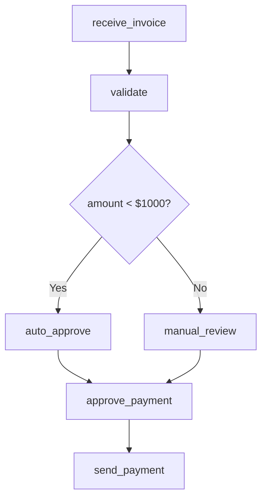

# Process Model Examples

This directory contains example process models discovered by OCPM.

## Format

Process models are stored in JSON format:

```json
{
  "nodes": ["activity1", "activity2", ...],
  "edges": {
    "activity1 -> activity2": {
      "frequency": 150,
      "confidence": 0.98
    }
  },
  "start_events": ["activity1"],
  "end_events": ["activityN"],
  "version": "1.0.0",
  "discovered_at": "2024-03-23T12:00:00Z"
}
```

## Available Models

### invoice_processing_v1.0.0.json
Initial discovered model from invoice processing event log.

**Bottlenecks identified**:
- `manual_review`: 45min p95, 80% frequency
- `manager_approval`: 2hr p95 for amounts >$5000

**Improvement potential**:
- Automate low-value approvals (<$1000)
- Parallelize validation and review steps

---

### invoice_processing_v2.0.0.json
Improved model after autonomous PI implementation.

**Changes**:
- Added `auto_approve` for invoices <$1000
- Removed `manual_review` for automated cases
- Added `exception_review` for flagged invoices

**Results**:
- p95 reduced from 45min → 8min (82% improvement)
- Manual effort reduced from 80% → 15%

---

### customer_onboarding_v1.0.0.json
Initial discovered model from customer onboarding event log.

**Bottlenecks identified**:
- `manual_configuration`: 2 business days
- `provisioning_wait`: 1 business day
- `data_entry_redundant`: duplicated across 3 activities

**Improvement potential**:
- Template-based configuration
- Automated provisioning
- Eliminate redundant data entry

---

### compliance_reporting_v1.0.0.json
Initial discovered model from compliance reporting event log.

**Bottlenecks identified**:
- `manual_data_collection`: 6 hours
- `manual_validation`: 1 hour
- `manual_aggregation`: 30 minutes

**Improvement potential**:
- Automated data pipelines
- Scheduled validation queries
- Template-based report generation

## Before/After Comparisons

### Invoice Processing

**Before (v1.0.0)**:
```
receive_invoice → validate → manual_review → manager_approval → approve_payment → send_payment
                     ↑              ↑
                     |              |
                   bottleneck     bottleneck
                   (45min p95)   (2hr p95)
```

**After (v2.0.0)**:
```
receive_invoice → validate → auto_approve (if <$1000) → approve_payment → send_payment
                           ↓
                     exception_review (if flagged)
```

**Metrics**:
| Metric | Before | After | Improvement |
|--------|--------|-------|-------------|
| p95 Duration | 45min | 8min | 82% |
| Manual Effort | 80% | 15% | 81% |
| Error Rate | 5% | 1% | 80% |

## Visualizing Process Models

Use Mermaid.js to visualize process models:



## Version History

Process models follow Semantic Versioning:
- **MAJOR**: Breaking changes (removed activities, new workflows)
- **MINOR**: Additions (new activities, new transitions)
- **PATCH**: Fixes (corrections to discovered model)

## Usage

Load process model for comparison:

```elixir
model = Canopy.OCPM.ProcessModel.get("invoice_processing", "2.0.0")
# Compare with previous version
previous = Canopy.OCPM.ProcessModel.get("invoice_processing", "1.0.0")
diff = Canopy.OCPM.Discovery.compare_models(previous, model)
```
